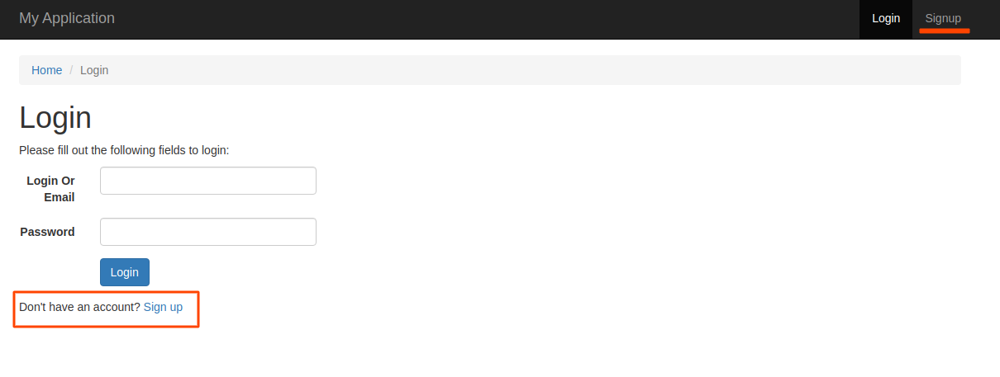
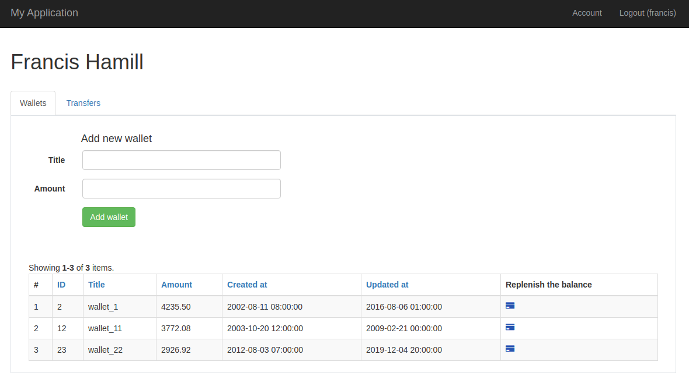
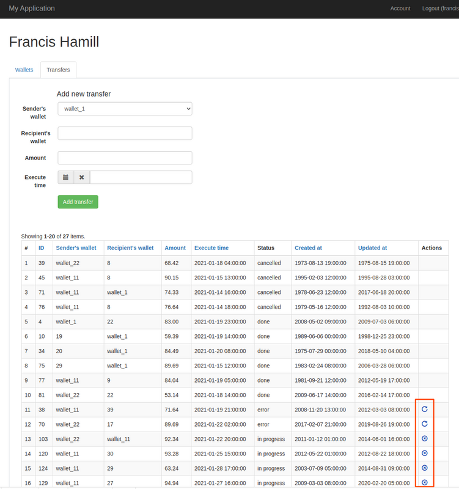
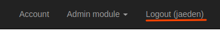
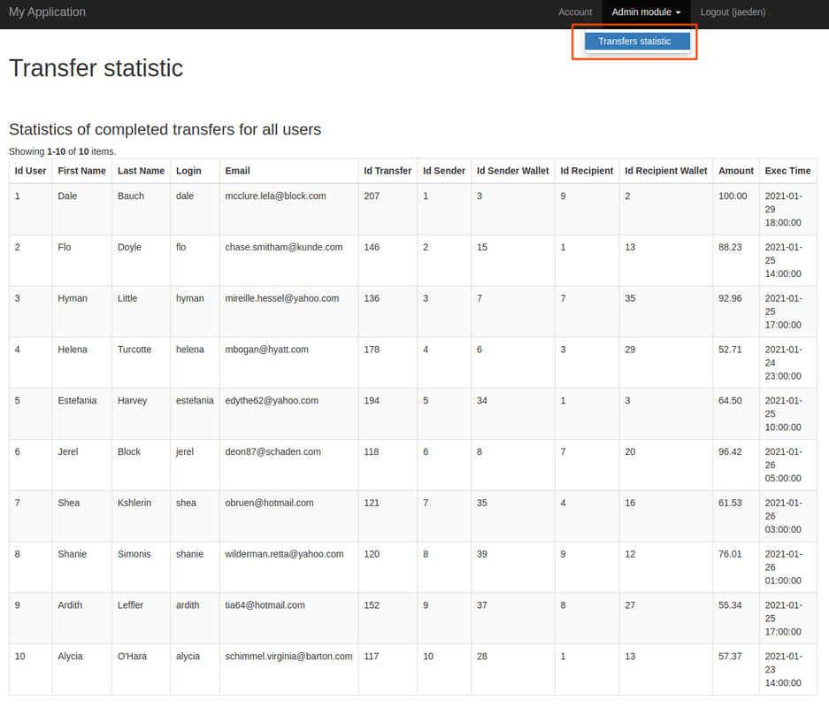

Всего в проекте есть 4 страницы: авторизация, регистрация, личный кабинет, статистика переводов.

**Авторизация и регистрация**. Страницы авторизации и регистрации доступны соответственно по путям /site/login и /site/signup.
Если пользователь не авторизован, то он будет автоматически перенаправлен на страницу авторизации. При необходимости регистрации можно перейти на страницу регистрации с помощью ссылки на странице авторизации, либо с помощью меню (на скриншоте внизу выделено красным).

Аналогично устроена и страница регистрации. После регистрации пользователь будет перенаправлен в личный кабинет, после авторизации - на полденюю посещенную перед авторизацией страницу.

**Личный кабинет** Доступен по пути /user/<login>. В личном кабинете есть таб-панель с двумя вкладками: Wallets и Transfers. На первой можно просмотреть свои счета, добавить новый счет с помощью формы, а также пополнить один из уже созданных счетов с помощью нажатия на иконку карточки в стоблце "Replenish the balance" таблицы со счетами.

На второй вкладке можно аналогично первой создать перевод и просмотреть уже существующие переводы. Кроме того, если перевод ранее не выполнился, то можно повторить его нажатием на иконку repeat в столбце "Actions" таблицы с переводами. После этого выболнение перевода будет запланировано на начало ближайшего часа. Отменить перевод можно нажатием на иконку cancel в том же столбце.
При этом отменить можно только переводы, которые ожидают выполнения, а повторить - только переводы, которые ранее не выполнились (при попытке выполнения возникла ошибка). Данные иконки выделены красным на картинке ниже.

Чтобы сделать logout, необходимо кликнуть по пункту меню Logout

**Статистика переводов**. Доступна по пути /admin/transfer/statistic. Если пользователь имеет права администратора, то в меню отобразится пункт Admin module, он содержит подпункт Transfers statistic (выделено красным на слайде ниже). При клике по этому подпункту пользователь будет перенаправлен на страницу со статистикой переводов.

В таблице со статистикой показаны последние выполненные переводы всех пользователей.